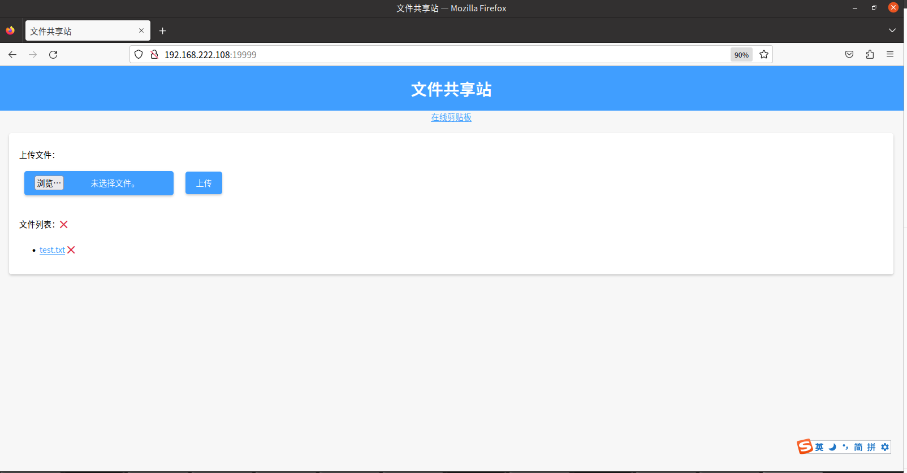

# local_fileshare
局域网的文件共享站

## 介绍
- 本项目是一个局域网内文件共享的工具，可以在局域网内的多台电脑之间互传文件。

  

## 使用
- 服务端：`python run.py`

  可在`run.py`中修改端口号，默认为`9999`；另外`index.html`中的`共享剪切板地址`也可自行修改，用于跳转至[共享剪切板](https://github.com/Li1Fan/local_clipboard)。

- 浏览器访问，如：`http://192.168.222.108:9999`

  选择文件，点击上传，即可在局域网内的其他电脑上（访问同样的地址），查看到文件并下载。

界面如下：

